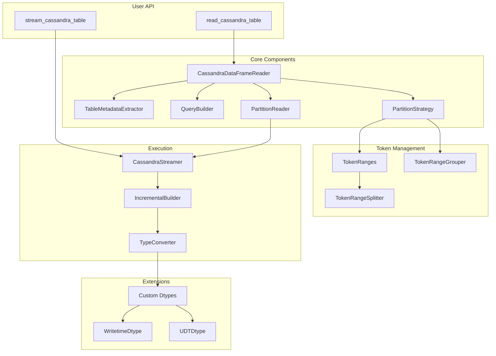
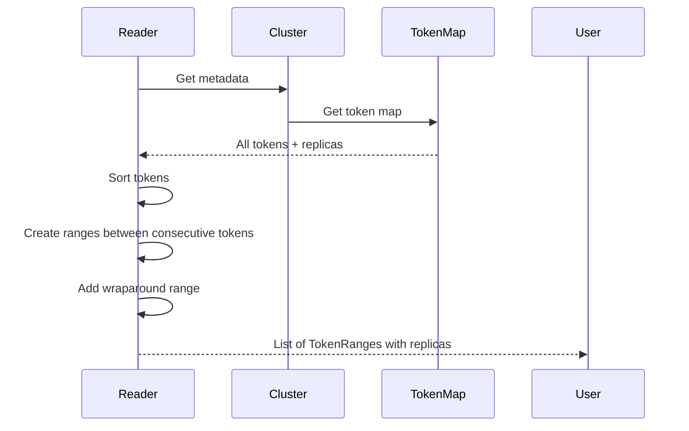
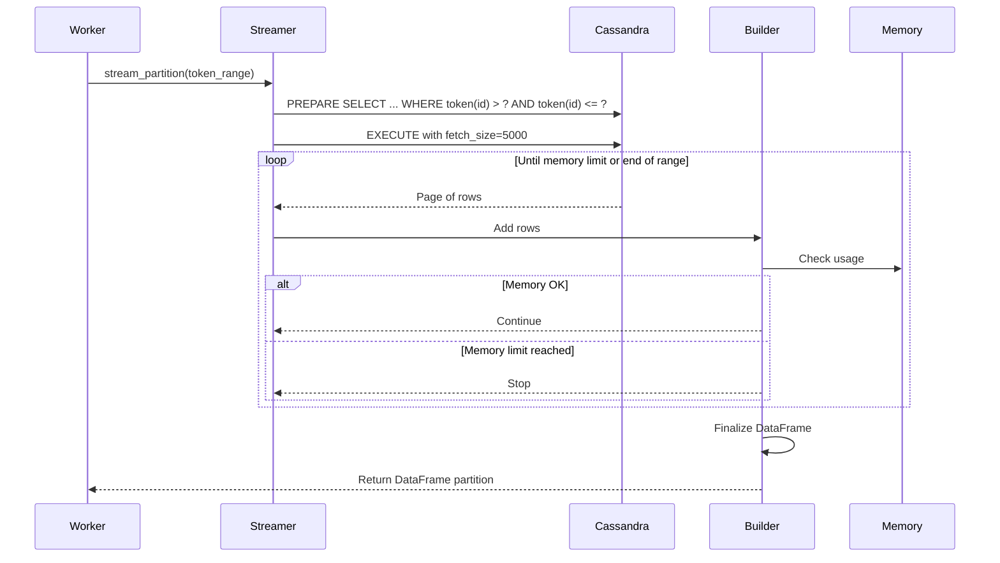
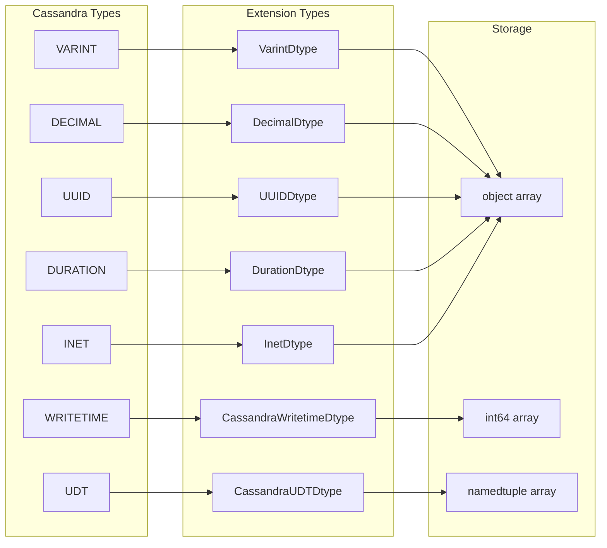
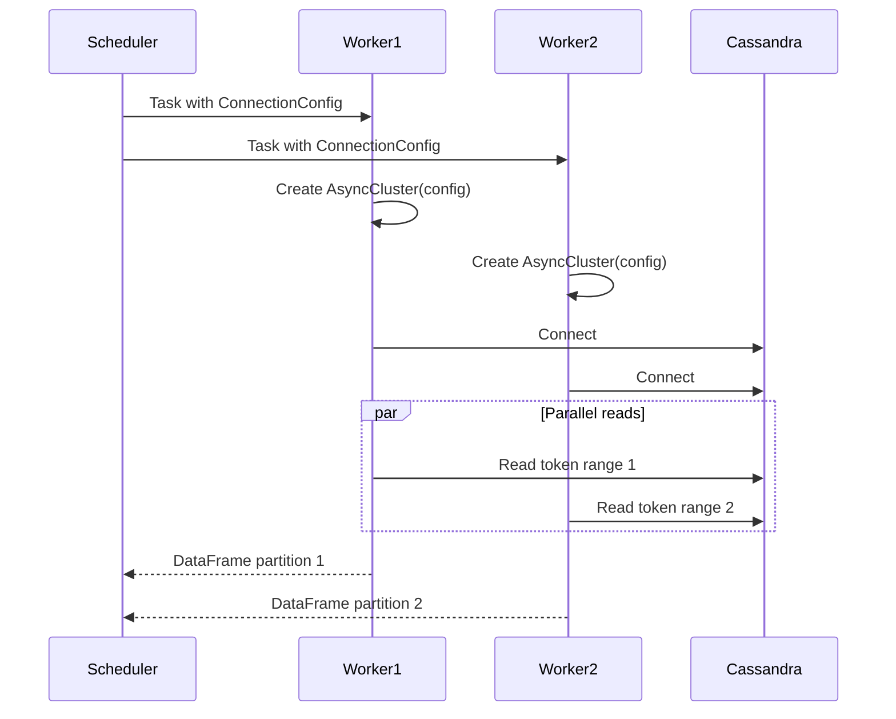

# 📐 Architecture Deep Dive

This document explains the internal architecture and design decisions of cassandra-dask-dataframe.

## 🎯 Core Design Principles

1. **Memory Safety**: Never load more data than specified limits
2. **Distribution Aware**: Leverage Cassandra's token ring topology
3. **Type Preservation**: Maintain Cassandra type semantics in pandas
4. **Zero Copy**: Stream data directly without intermediate copies
5. **Failure Resilient**: Handle node failures and partial reads gracefully

## 🗺️ Architecture Overview



## 🎪 Token Range Alignment

### The Problem

Cassandra uses consistent hashing to distribute data across nodes. Each node is responsible for a range of tokens. Traditional approaches either:
- Read from a single coordinator (slow, creates hotspots)
- Randomly distribute reads (no data locality, inefficient)

### Our Solution

We align Dask partitions with Cassandra's natural token ranges:

```python
# Discover actual token ranges from cluster
token_ranges = await discover_token_ranges(session, keyspace)
# Returns: [TokenRange(start=-9223..., end=-6148..., replicas=['10.0.0.1']), ...]

# Create partitions aligned with these ranges
partitions = strategy.create_partitions(token_ranges)
# Each partition reads its assigned token range
```

### Token Range Discovery



### Handling Wraparound

The token ring wraps around from MAX_TOKEN to MIN_TOKEN. We handle this specially:

```python
# Normal range
if start < end:
    WHERE token(id) > start AND token(id) <= end

# Wraparound range (split into two queries)
if start > end:
    # Part 1: From start to MAX_TOKEN
    WHERE token(id) > start AND token(id) <= 9223372036854775807
    # Part 2: From MIN_TOKEN to end
    WHERE token(id) >= -9223372036854775808 AND token(id) <= end
```

## 🎲 Partitioning Strategies

### Strategy Selection

```python
# Strategy selection logic
if partition_count is specified:
    use FIXED strategy with exact count
elif vnode_count <= 16:
    use NATURAL strategy (1 partition per range)
elif vnode_count <= 128:
    use COMPACT strategy with target_size
else:
    use COMPACT strategy with larger targets
```

### Available Strategies

#### 1. **NATURAL** - One Partition Per Token Range
```python
# Best for small clusters or tables
# Example: 16 vnodes = 16 partitions
partitions = [
    Partition(token_range=ranges[0]),
    Partition(token_range=ranges[1]),
    ...
]
```

#### 2. **COMPACT** - Group Small Ranges
```python
# Groups ranges to meet target size
# Example: 256 vnodes grouped into 50 partitions
group1 = [ranges[0], ranges[1], ranges[2], ranges[3], ranges[4]]
group2 = [ranges[5], ranges[6], ranges[7], ranges[8], ranges[9]]
```

#### 3. **SPLIT** - Split Large Ranges
```python
# Each range split into N parts
# Example: 16 vnodes split 4x = 64 partitions
range1_parts = ranges[0].split(4)  # Creates 4 sub-ranges
```

#### 4. **FIXED** - Exact Partition Count
```python
# User specifies exact number
# Ranges distributed proportionally
partition_count = 100
partitions = distribute_ranges(all_ranges, partition_count)
```

## 🌊 Memory-Bounded Streaming

### The Challenge

We can't know the exact data size without reading it all (defeating the purpose). Our solution:

1. **Sample** a small portion to estimate row size
2. **Calculate** rows that fit in memory limit
3. **Stream** with async iteration
4. **Monitor** actual memory usage
5. **Stop** before exceeding limit

### Streaming Architecture



### Incremental DataFrame Building

```python
class IncrementalDataFrameBuilder:
    def __init__(self, memory_limit_mb: int):
        self.chunks = []
        self.memory_limit = memory_limit_mb * 1024 * 1024

    def add_rows(self, rows: list) -> bool:
        # Convert to DataFrame chunk
        chunk = pd.DataFrame(rows)

        # Check memory
        current_memory = sum(df.memory_usage(deep=True).sum()
                           for df in self.chunks)
        chunk_memory = chunk.memory_usage(deep=True).sum()

        if current_memory + chunk_memory > self.memory_limit:
            return False  # Stop streaming

        self.chunks.append(chunk)
        return True  # Continue

    def build(self) -> pd.DataFrame:
        if not self.chunks:
            return pd.DataFrame()
        return pd.concat(self.chunks, ignore_index=True)
```

## 🎨 Type System Design

### Custom Extension Types

Cassandra has types that don't map cleanly to pandas/NumPy. We created custom extension types:



### UDT (User Defined Type) Handling

UDTs are complex - they're composite types with named fields:

```python
# Cassandra UDT
CREATE TYPE address (
    street text,
    city text,
    zip int
)

# Becomes namedtuple in Python
Address = namedtuple('address', ['street', 'city', 'zip'])
row.address = Address(street='123 Main', city='Boston', zip=12345)

# Stored in CassandraUDTArray
class CassandraUDTArray(ExtensionArray):
    def __init__(self, values, udt_definition):
        # Store namedtuples directly
        self._data = np.array(values, dtype=object)
        self._udt_def = udt_definition
```

### Writetime Support

Writetime is metadata, not a regular column:

```python
# Query includes writetime
SELECT id, name, WRITETIME(name) as name_writetime FROM users

# Special dtype preserves microsecond precision
class CassandraWritetimeDtype(ExtensionDtype):
    @property
    def type(self):
        return int  # Microseconds since epoch

    def __str__(self):
        return "cassandra_writetime"
```

## 🚀 Distributed Execution

### Local vs Distributed Mode Detection

```python
def _create_dask_dataframe(self, partitions, meta):
    try:
        Client.current()  # Raises if no client
        is_distributed = True
    except ValueError:
        is_distributed = False

    if is_distributed:
        # Use serializable connection config
        delayed = dask.delayed(read_partition_distributed)(
            partition_def, self.connection_config
        )
    else:
        # Pass session directly
        delayed = dask.delayed(read_partition_sync)(
            partition_def, self.session
        )
```

### Worker Connection Management

Each worker creates its own Cassandra connection:



### Connection Config Serialization

```python
@dataclass
class ConnectionConfig:
    """Serializable connection configuration."""
    contact_points: list[str]
    port: int = 9042
    auth_provider_class: str | None = None
    auth_provider_args: dict | None = None
    ssl_context: dict | None = None  # Serialized SSL settings

    def to_cluster_kwargs(self) -> dict:
        """Convert to async-cassandra Cluster kwargs."""
        kwargs = {
            'contact_points': self.contact_points,
            'port': self.port,
        }

        if self.auth_provider_class == 'PlainTextAuthProvider':
            from cassandra.auth import PlainTextAuthProvider
            kwargs['auth_provider'] = PlainTextAuthProvider(
                **self.auth_provider_args
            )

        return kwargs
```

## 🔍 Query Optimization

### Predicate Pushdown

We analyze predicates to determine what can be pushed to Cassandra:

```python
# User provides predicates
predicates = [
    {'column': 'status', 'operator': '=', 'value': 'active'},
    {'column': 'created_at', 'operator': '>', 'value': '2024-01-01'}
]

# Analyzer determines pushdown capability
analyzer = PredicatePushdownAnalyzer(table_metadata)
pushdown, client_side, use_token_ranges = analyzer.analyze(predicates)

# Pushdown: ['status = ?'] (can use with ALLOW FILTERING)
# Client-side: ['created_at > ?'] (applied after fetch)
# use_token_ranges: True (no partition key predicates)
```

### Query Building Rules

1. **Token ranges** take precedence for distribution
2. **Partition key** predicates disable token ranges
3. **Clustering key** predicates can be pushed down
4. **Regular column** predicates need ALLOW FILTERING
5. **Complex predicates** handled client-side

## 🛡️ Resilience & Error Handling

### Partial Read Handling

```python
async def stream_partition(self, partition_def):
    try:
        # Normal streaming
        return await self._stream_data(partition_def)
    except Exception as e:
        if partition_def.get('allow_partial_results'):
            # Return what we have
            logger.warning(f"Partial read: {e}")
            return self.builder.build()
        else:
            # Fail fast
            raise
```

### Connection Retry

```python
class ResilientConnection:
    async def execute_with_retry(self, query, values, max_retries=3):
        for attempt in range(max_retries):
            try:
                return await self.session.execute(query, values)
            except (OperationTimedOut, ReadTimeout) as e:
                if attempt < max_retries - 1:
                    await asyncio.sleep(2 ** attempt)  # Exponential backoff
                else:
                    raise
```

## 🔮 Future Enhancements

### Planned Features

1. **Write Support**: Distributed writes back to Cassandra
2. **CDC Integration**: Change Data Capture streaming
3. **Spark Compatibility**: Read Spark-written tables
4. **Compaction Awareness**: Avoid reading during compaction
5. **Repair Awareness**: Handle inconsistent data during repairs

### Performance Optimizations

1. **Column Pruning**: Push column selection to storage
2. **Predicate Caching**: Cache prepared statements
3. **Statistics**: Use table statistics for better partitioning
4. **Compression**: Compress data transfers
5. **Zero-Copy**: Direct buffer transfers where possible

---

<div align="center">
🏗️ Built for scale, designed for elegance 🏗️
</div>
