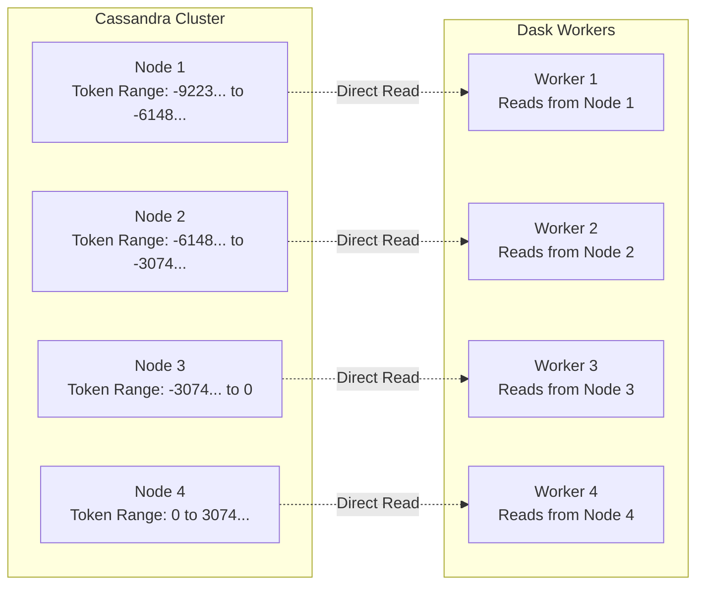

# 🚀 Cassandra Dask DataFrame

[](https://opensource.org/licenses/Apache-2.0)
[](https://www.python.org/downloads/)
[](https://github.com/psf/black)
[](https://pycqa.github.io/isort/)
[](http://mypy-lang.org/)

> ⚠️ **In Development**: This library is under active development. APIs may change, and you may encounter edge cases. We welcome your feedback and contributions!

## 🎯 What is This?

**cassandra-dask-dataframe** bridges Apache Cassandra© and Dask, enabling you to read and process massive Cassandra tables using distributed DataFrames. It intelligently aligns Dask partitions with Cassandra token ranges for optimal data locality and performance.

## 🤔 Why Do You Need This?

### The Problem

Working with large Cassandra tables in Python is challenging:
- 📊 **Too Big for Memory**: Tables with billions of rows won't fit in pandas
- 🐌 **Slow Sequential Processing**: Reading everything through one connection is inefficient
- 🔄 **No Native Distribution**: Standard drivers don't parallelize across the cluster
- 💾 **Memory Management**: Easy to OOM when processing large results

### The Solution

This library solves these problems by:
- 🎛️ **Distributed Processing**: Leverages Dask to process data across multiple workers
- 🗂️ **Smart Partitioning**: Aligns partitions with Cassandra's token ranges
- 🌊 **Streaming Reads**: Memory-bounded streaming prevents OOM errors
- ⚡ **Parallel Connections**: Each worker connects directly to Cassandra
- 🧮 **Familiar API**: Use pandas-like operations on massive datasets

## 📚 Understanding Dask

[Dask](https://www.dask.org/) is a flexible parallel computing library for Python that scales pandas, NumPy, and scikit-learn workflows to larger datasets.

### Local vs Distributed Mode

#### 🖥️ Local Mode
- Runs on your laptop/single machine
- Uses threads/processes for parallelism
- Great for development and moderate datasets
- No setup required

```python
# Local mode - Dask runs on your machine
df = await cdf.read_cassandra_table('my_table', session=session)
result = df.groupby('category').mean().compute()  # Runs locally
```

#### 🌐 Distributed Mode
- Runs across multiple machines
- Dedicated scheduler and workers
- Handles massive datasets
- Requires cluster setup

```python
# Distributed mode - Dask runs on a cluster
from dask.distributed import Client

async with Client('scheduler:8786') as client:
    df = await cdf.read_cassandra_table('my_table', session=session)
    result = await client.compute(df.groupby('category').mean())  # Runs distributed
```

## 🔧 How It Works

### 🎯 Token Range Alignment

Cassandra distributes data across nodes using token ranges. This library aligns Dask partitions with these ranges for optimal performance:



Benefits of this approach:
- ✅ **Data Locality**: Workers read from nearby nodes
- ✅ **No Duplicates**: Token ranges don't overlap
- ✅ **Perfect Coverage**: All data is read exactly once
- ✅ **Natural Parallelism**: Leverages Cassandra's distribution

### 🌊 Memory-Bounded Streaming

Instead of loading entire partitions into memory, we stream data in controlled chunks:

1. **Sample** data to estimate row sizes
2. **Calculate** how many rows fit in memory limit
3. **Stream** data in batches up to that limit
4. **Build** DataFrame incrementally
5. **Monitor** memory usage continuously

## 🚦 Quick Start

### Installation

```bash
pip install cassandra-dask-dataframe
```

### Basic Usage

```python
import asyncio
from async_cassandra import AsyncCluster
import cassandra_dask_dataframe as cdf

async def analyze_large_table():
    # Connect to Cassandra
    async with AsyncCluster(['cassandra-node1', 'cassandra-node2']) as cluster:
        async with cluster.connect() as session:
            await session.set_keyspace('my_keyspace')

            # Read table as Dask DataFrame
            df = await cdf.read_cassandra_table(
                'large_events_table',
                session=session,
                memory_per_partition_mb=256  # Control memory usage
            )

            # Perform distributed operations
            daily_stats = (
                df[df.status == 'success']
                .groupby(df.timestamp.dt.date)
                .agg({'value': ['sum', 'mean', 'count']})
            )

            # Compute results
            result = daily_stats.compute()
            print(result)

asyncio.run(analyze_large_table())
```

## 📖 Usage Examples

> 🚧 **Coming Soon**: Detailed usage examples and tutorials are in development. For now, see the Quick Start above.

<!-- Placeholder for future examples:
- Column selection and projection
- Writetime and TTL queries
- Predicate pushdown
- Custom partitioning strategies
- Working with User Defined Types
- Distributed cluster setup
- Performance tuning
-->

## 🏗️ Development

See [DEVELOPMENT.md](DEVELOPMENT.md) for:
- Setting up your development environment
- Running tests
- Contributing guidelines
- Architecture details

## 📐 Architecture

See [ARCHITECTURE.md](ARCHITECTURE.md) for deep dives into:
- Token range alignment algorithm
- Partitioning strategies
- Type system design
- Distributed execution model

## 🤝 Contributing

We welcome contributions! This project uses:
- Apache 2.0 License
- Contributor License Agreement (CLA) for contributions
- Test-Driven Development (TDD)
- Comprehensive CI/CD pipeline

Please read [DEVELOPMENT.md](DEVELOPMENT.md) before contributing.

## 📝 License

This project is licensed under the Apache License 2.0 - see the [LICENSE](LICENSE) file for details.

## 🙏 Acknowledgments

Built on top of these excellent projects:
- [async-cassandra](https://github.com/axonops/async-cassandra) - Async Cassandra driver
- [Dask](https://www.dask.org/) - Distributed computing framework
- [Apache Cassandra©](https://cassandra.apache.org/) - The database we all love

---

<div align="center">
Made with ❤️ for the Cassandra community
</div>
